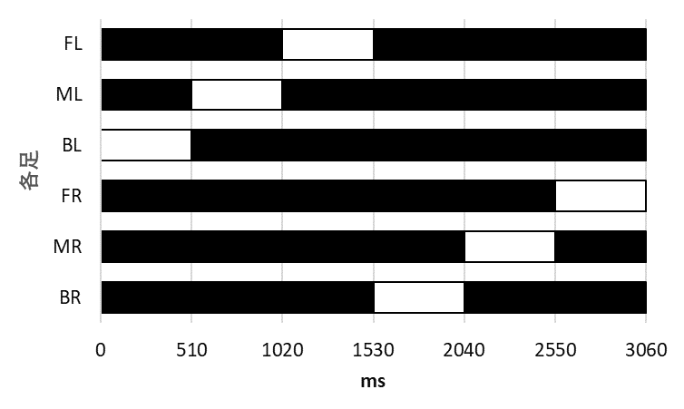

# 六足移動ロボット

### 全体図
  
- ボディ：全長 205mm, 全幅 168mm, 全高 43.4mm
- 足の長さ：リンク1.1 : 82.0mm
- 前足の中足の角度：50°
- 中足と後足の角度：40°
- ロボット全体の質量：1802g

### リンク

### リンクの比率
**リンク1.1：リンク1.2：リンク2.1：リンク2.2：リンク3.1：リンク3.3  
=  1.00   :     1.91 :     1.04 :     2.00 :     1.34 : 2.66**

### 歩行メカニズム

以下の表では脚の動作における一周期の接地パターンを示しており、黒色で示された区間は足が地面に接地しているフェーズ、白色の区間は足が地面から離れているフェーズを表している。
- **三脚歩行 (Tripod Gaits)**  

- **四脚歩行 (Tetrapod Gaits)**  

- **波状歩行 (Wave Gaits)**

## ICS 変換基板の詳細
[近藤科学 ICS変換基板 チュートリアル](https://kondo-robot.com/faq/ics_board_-tutorial1)  
(公式サイト : Kondo Kagaku)

##  ICS3.5/3.6 Manager Software
[ICS3.5/3.6 Manager Software](https://kondo-robot.com/faq/ics35mag)  
(公式サイト : Kondo Kagaku)